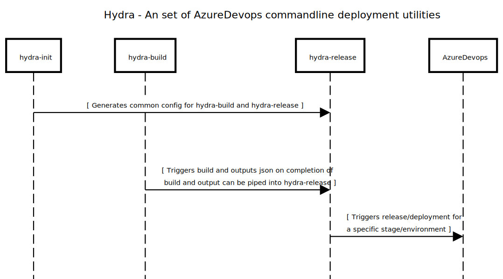

# *Hydra*

---
### Installation 
Clone repository to your system.

#### Environment Variable :
Set below environment variable to your powershell session.
```pwsh
$env:DEVOPS_PAT="<Az_Devops_pat with appropriate permission>"
```
#### Pre-requesites:
Install Pre-reqesites by using below command
```pwsh
 Install-Module -Name psfzf -Force
```
#### Usage:

##### hydra-init - Generates Configuration :
Generate "config.json" file using below command ($HOME/.hydra/config.json)
```pwsh
# Execute below command at the root of the repo
./hydra-init.ps1 -organisation <Orgainsation_name> -project <Project_name> `
-environment <List of comma seperated names of deploymen stages(eg: DEV,SIT,UAT)> `
-manual_trigger <List of comma seperated names of deploymen stages for isolated deployment(eg: DEV,SIT,UAT)> 
```


---
##### hydra-build - Trigger Build :
Trigger build by using below command.
```pwsh
./hydra-build -Branch <Branch Name> -Environmen <Azure Devops release Stage>
```


---
##### hydra-release - Create, Approve, Deploy :
Creates, Approves and Deploys user-selected Releases to user-specified stage/environment
```pwsh
<# 
Flags: 
 -interactive   # Interactive deployment using FZF
 -dbg           # Ouputs verbose output to screen
 -auto_approve  # Auto-approves release Deployment
#>

# Deploy in interactive mode with vebose output.
./hydra-build -interactive -dbg
```

